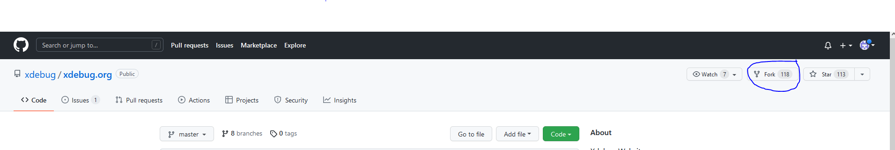
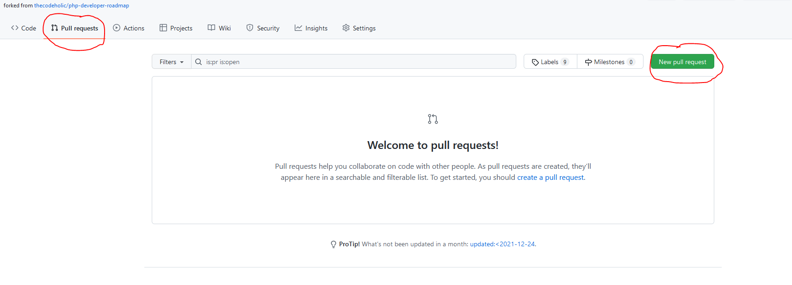
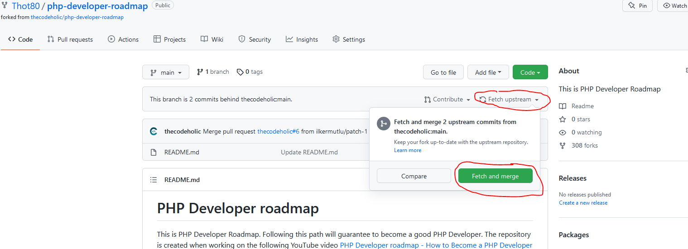

# Vidéothèque

## Contributeurs

- Massinissa
- Inocent
- Jérémy

## [Forking Workflow](https://www.atlassian.com/git/tutorials/comparing-workflows/forking-workflow)

### Introduction

Le workflow appelé *forking workflow* est fondamentalement différent des autres workflows git populaires. Au lieu d'utiliser un dépôt distant central commun à tous les développeurs, chacun possède sa propre version côté serveur du projet.

Ainsi, chaque contributeur ne possède non pas un mais deux repository git, **1 repo privé local et 1 public côté serveur**.

C'est le workflow le plus utilisé pour les projets open source car il permet à de nombreuses personnes de collaborer sans se connaitre au préalable, chaque personne qui souhaite contribuer le peut sans en avoir au préalable demandé l'autorisation. 

Ce workflow est aussi adapté aux projets avec un control plus strict et centralisé du code qui est ajouté au projet, il semble donc bien adapté à un projet d'étude, avec des apprenants, des développeurs peu expérimentés, où il peut être bénéfique de bien controller le code avant de l'intégrer. 

### Mise en oeuvre

#### Fork

Pour collaborer au projet, un développeur commence par faire un fork du dépôt officiel du projet. On se rend d'abord sur la [page du projet vidéothèque](https://github.com/Thot80/videotheque).
On le fork.



Vous êtes maintenant en possession de **votre copie du projet** sur votre serveur distant.

### Clone

 Vous pouvez cloner votre version du projet en local et travailler dessus.

```git clone [adresse de VOTRE dépot distant] ```

Le projet est maintenant disponible en local, votre dépôt distant s'appelle origin.

### Remote Secondaire

À la différence des autres GitFlow, chacun travail ici avec 2 remotes, 2 dépôts distants, le sien propre et le dépôt officiel du projet. Il faut configurer son dépôt local pour traquer les changements apportés au dépôts officiels lorsqu'on souhaite se synchroniser. Par convention, on appelle ce remote *upstream*.

``git remote add upstream https://github.com/Thot80/videotheque.git``

### Travail par Branche

Quand un développeur travail sur une **feature**, c'est-à-dire un ensemble de fonctionnalités liées entre elles (Entité user + Repository + page de connexion + page inscription par exemple), il crée une branche avec un nom explicite associé à la feature et travail dessus :

```git checkout -b user-feature  ```

### Philosophie du commit

On essaye de faire un commit par fonctionnalité ou par bogue réglé.

```git status```

```git add fichiers-choisis```

```git commit -m "mon message de commit" ```

### Pull Request

Lorsqu'une feature est développée, le développeur doit push la feature sur son dépôt personnel, **il ne push pas sur le main** mais sur la branche en question.

```git push origin user-branch```

On ouvre alors une pull request de cette branche vers le dépôt officiel :



### Validation du Responsable

- Le Responsable pull la contribution en local
- Il fusionne la branche sur son main
- Il règle les conflits éventuels 
- Il vérifie que le résultat est toujours fonctionnel
- Il push sur le main de son remote

### De la Synchronisation

Bien penser à régulièrement synchroniser sa version personnelle du projet avec la version officielle :

